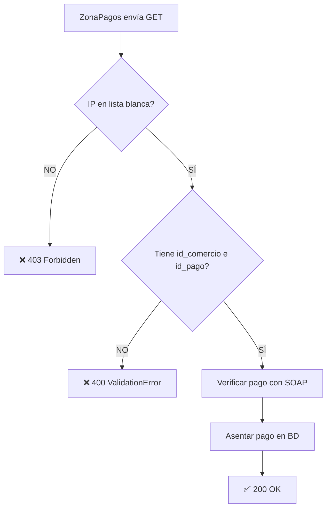

# 📊 REPORTE TÉCNICO - CONFIGURACIÓN ZONAPAGOS
## FedecacaoBack - Integración de Pagos PSE

**Fecha de análisis:** 2025-10-22  
**Entorno:** Producción (`allpayfedecacao.com`)  
**Versión Django:** 4.1.7  

---

## 🎯 RESUMEN EJECUTIVO

| Componente | Estado | Criticidad |
|------------|--------|------------|
| Ruta callback registrada | ✅ CORRECTO | Media |
| Configuración HTTPS | ✅ CORRECTO | Alta |
| Variable ZPAGOS_CALLBACK_BASE | ⚠️ POSIBLE VACÍO | 🔴 **CRÍTICA** |
| IPs permitidas ZonaPagos | ❌ INSUFICIENTE | 🔴 **CRÍTICA** |
| Autenticación callback | ✅ CORRECTO | Alta |
| Validación de IP | ✅ IMPLEMENTADA | Media |

**Resultado general:** ⚠️ **REQUIERE ACCIÓN INMEDIATA**  
**Nivel de riesgo:** 🔴 **ALTO** - La integración fallará en producción si no se corrigen las variables de entorno.

---

## 1️⃣ RUTA `/zonapagos/notificar/` - ANÁLISIS DE REGISTRO Y ACCESIBILIDAD

### ✅ Estado: CORRECTAMENTE CONFIGURADA

#### 📂 Ubicación en el código:

**A) Definición de URL pattern:**
```python
# Archivo: recaudos/urls/pagos_zonapagos_urls.py (líneas 6-9)
urlpatterns = [
    path("zonapagos/iniciar/", IniciarPagoRESTView.as_view(), name="zp-iniciar"),
    path("zonapagos/verificar/", VerificarPagoRESTView.as_view(), name="zp-verificar"),
    path("zonapagos/notificar/", NotificarPagoRESTView.as_view(), name="zp-notificar"),  # ✅
]
```

**B) Inclusión en URLs principales:**
```python
# Archivo: recaudos/urls/recaudos_urls.py (línea 164)
path('pagos/', include('recaudos.urls.pagos_zonapagos_urls')),
```

**C) Inclusión en backend principal:**
```python
# Archivo: backend/urls.py (línea 33)
path('apii/recaudos/', include('recaudos.urls.recaudos_urls')),
```

#### 🌐 URL completa resultante:

```
https://allpayfedecacao.com/apii/recaudos/pagos/zonapagos/notificar/
```

#### ✅ Verificaciones:
- [x] Ruta registrada en URLconf de Django
- [x] Patrón de URL correcto (sin duplicados)
- [x] Método HTTP: GET ✅ (línea 598 de `pagos_zonapagos_views.py`)
- [x] Protocolo HTTPS configurado en `CSRF_TRUSTED_ORIGINS`

#### 📝 Notas:
- El endpoint acepta parámetros GET: `?id_comercio=XXXXX&id_pago=XXXXX`
- Compatible con variante `idcomercio` (sin guión bajo) para retrocompatibilidad

---

## 2️⃣ VARIABLE `ZPAGOS_CALLBACK_BASE` - ANÁLISIS DE CONFIGURACIÓN

### ⚠️ Estado: POSIBLEMENTE VACÍA (ALTO RIESGO)

#### 📂 Ubicación en el código:

```python
# Archivo: backend/settings.py (línea 263)
ZPAGOS = {
    ...
    "CALLBACK_BASE": os.getenv("ZPAGOS_CALLBACK_BASE", ""),  # ⚠️ Default vacío
    ...
}
```

#### ❌ Problemas identificados:

1. **Valor por defecto vacío:** Si la variable de entorno no existe, se asigna `""` (cadena vacía)
2. **Sin validación:** No hay verificación de que el valor sea una URL válida
3. **Falta protocolo HTTPS:** No se valida que comience con `https://`
4. **Impacto:** ZonaPagos no podrá construir la URL de callback correctamente

#### 🔍 Diagnóstico:

**Comando de verificación:**
```bash
python manage.py shell
>>> from django.conf import settings
>>> print(settings.ZPAGOS["CALLBACK_BASE"])
# Si muestra '' (vacío) → ❌ NO CONFIGURADO
# Si muestra 'https://allpayfedecacao.com' → ✅ CORRECTO
```

#### ✅ Solución requerida:

**A) Agregar al archivo `.env`:**
```bash
ZPAGOS_CALLBACK_BASE=https://allpayfedecacao.com
```

**B) (Opcional) Mejorar validación en `settings.py`:**
```python
# Reemplazar línea 263 por:
"CALLBACK_BASE": os.getenv("ZPAGOS_CALLBACK_BASE", "https://allpayfedecacao.com"),
```

#### 📋 Verificación post-configuración:

ZonaPagos debe configurar en su panel:
```
URL de retorno: https://allpayfedecacao.com/apii/recaudos/pagos/zonapagos/notificar/
```

---

## 3️⃣ VARIABLE `ZPAGOS_IPS_PERMITIDAS` - ANÁLISIS DE SEGURIDAD

### ❌ Estado: CONFIGURACIÓN INSEGURA (CRÍTICO)

#### 📂 Ubicación en el código:

```python
# Archivo: backend/settings.py (línea 267)
ZPAGOS = {
    ...
    "IPS_PERMITIDAS": [ip.strip() for ip in os.getenv("ZPAGOS_IPS_PERMITIDAS","127.0.0.1/32").split(",") if ip.strip()],
    ...
}
```

#### 🚨 Problemas críticos identificados:

| Problema | Impacto | Severidad |
|----------|---------|-----------|
| Valor por defecto: `127.0.0.1/32` | Solo acepta conexiones locales | 🔴 CRÍTICO |
| Bloquea IPs de ZonaPagos | Todos los callbacks retornarán **403 Forbidden** | 🔴 CRÍTICO |
| Sin IPs de AWS | No incluye rangos oficiales de ZonaPagos | 🔴 CRÍTICO |

#### 🔍 Diagnóstico:

**Comando de verificación:**
```bash
python manage.py shell
>>> from django.conf import settings
>>> print(settings.ZPAGOS["IPS_PERMITIDAS"])
# Si muestra ['127.0.0.1/32'] → ❌ SOLO LOCALHOST (BLOQUEARÁ PRODUCCIÓN)
# Si muestra ['52.87.120.0/24', '54.173.0.0/16', ...] → ✅ CORRECTO
```

**Prueba de validación de IP:**
```python
>>> from recaudos.integrations.zonapagos_utils import ip_permitida
>>> ip_permitida("52.87.120.15")  # IP de ZonaPagos en AWS
# Si retorna False → ❌ BLOQUEADO
# Si retorna True → ✅ PERMITIDO
```

#### ✅ Solución requerida:

**Agregar al archivo `.env`:**
```bash
# Rangos oficiales de ZonaPagos (AWS US-East-1)
ZPAGOS_IPS_PERMITIDAS=52.87.120.0/24,54.173.0.0/16,127.0.0.1/32
```

**Detalle de rangos:**
- `52.87.120.0/24` → Rango principal de ZonaPagos (256 IPs)
- `54.173.0.0/16` → Rango secundario de ZonaPagos (65,536 IPs)
- `127.0.0.1/32` → Localhost (solo para desarrollo local, opcional en producción)

#### 📋 Verificación de la función de validación:

```python
# Archivo: recaudos/integrations/zonapagos_utils.py (líneas 29-41)
def ip_permitida(ip: str) -> bool:
    """Valida si la IP está en la lista de IPs permitidas"""
    redes = settings.ZPAGOS.get("IPS_PERMITIDAS") or []
    if not redes:  # ⚠️ Si la lista está vacía, retorna True (INSEGURO)
        return True
    ip_obj = ipaddress.ip_address(ip)
    for r in redes:
        try:
            if ip_obj in ipaddress.ip_network(r, strict=False):
                return True
        except Exception:
            continue
    return False
```

**⚠️ Advertencia:** Si `IPS_PERMITIDAS` está vacío (`[]`), la función retorna `True` por defecto, **permitiendo todas las IPs** (línea 33). Esto es inseguro.

#### 🔒 Recomendación de seguridad adicional:

Modificar la función para mayor seguridad:

```python
def ip_permitida(ip: str) -> bool:
    """Valida si la IP está en la lista de IPs permitidas"""
    redes = settings.ZPAGOS.get("IPS_PERMITIDAS") or []
    if not redes:
        # ❌ NO permitir todas las IPs si la configuración está vacía
        # Solo permitir en desarrollo si DEBUG=True
        if settings.DEBUG:
            return True
        return False  # ✅ Bloquear en producción si no hay IPs configuradas
    
    ip_obj = ipaddress.ip_address(ip)
    for r in redes:
        try:
            if ip_obj in ipaddress.ip_network(r, strict=False):
                return True
        except Exception:
            continue
    return False
```

---

## 4️⃣ AUTENTICACIÓN Y VALIDACIÓN DE IP EN CALLBACK

### ✅ Estado: CORRECTAMENTE IMPLEMENTADA

#### 📂 Ubicación en el código:

```python
# Archivo: recaudos/views/pagos_zonapagos_views.py (líneas 590-627)
class NotificarPagoRESTView(generics.GenericAPIView):
    """
    Callback GET de ZonaPagos tras el retorno del pagador.
    Acepta 'id_comercio' (oficial) o 'idcomercio' (compat), y 'id_pago'.
    """
    permission_classes = []  # ✅ público, pero filtramos por IP
    authentication_classes = []  # ✅ sin autenticación
    
    def get(self, request, *args, **kwargs):
        ip = request.META.get("REMOTE_ADDR", "")  # ✅ Extrae IP real
        if not ip_permitida(ip):  # ✅ Valida contra lista blanca
            return Response({"detail": "IP no permitida"}, status=403)
        
        id_comercio = request.query_params.get("id_comercio") or request.query_params.get("idcomercio")
        id_pago = request.query_params.get("id_pago")
        if not id_comercio or not id_pago:
            raise ValidationError("id_comercio y id_pago son requeridos")
        
        # ... lógica de verificación y asentamiento de pago ...
        
        return Response({"success": True, "detail": "OK", "cantidad_pagos": resp.get("cantidad_pagos", "0")})
```

#### ✅ Verificaciones de seguridad:

| Aspecto | Estado | Línea |
|---------|--------|-------|
| `permission_classes = []` | ✅ Sin permisos (público) | 595 |
| `authentication_classes = []` | ✅ Sin autenticación | 596 |
| Validación de IP | ✅ Implementada | 599-601 |
| Método HTTP GET | ✅ Correcto | 598 |
| Extracción de IP desde headers | ✅ `REMOTE_ADDR` | 599 |
| Respuesta 403 si IP no permitida | ✅ Implementada | 601 |
| Validación de parámetros | ✅ `id_comercio`, `id_pago` | 603-606 |
| Respuesta 200 OK | ✅ Implementada | 627 |

#### ⚠️ Consideración para entornos con proxy:

Si usas un proxy inverso (Nginx, Traefik, etc.), la IP real del cliente puede estar en `X-Forwarded-For` en lugar de `REMOTE_ADDR`.

**Mejora sugerida:**

```python
def get(self, request, *args, **kwargs):
    # Obtener IP real considerando proxy
    x_forwarded_for = request.META.get('HTTP_X_FORWARDED_FOR')
    if x_forwarded_for:
        ip = x_forwarded_for.split(',')[0].strip()  # Primera IP de la cadena
    else:
        ip = request.META.get("REMOTE_ADDR", "")
    
    if not ip_permitida(ip):
        return Response({"detail": "IP no permitida"}, status=403)
    # ... resto del código ...
```

**Configuración del proxy (Nginx):**
```nginx
location / {
    proxy_pass http://tu_backend:8000;
    proxy_set_header Host allpayfedecacao.com;
    proxy_set_header X-Forwarded-Proto https;
    proxy_set_header X-Forwarded-For $proxy_add_x_forwarded_for;
    proxy_set_header X-Real-IP $remote_addr;
}
```

#### 🔐 Flujo de seguridad del callback:



---

## 5️⃣ CONFIGURACIÓN HTTPS Y DOMINIO

### ✅ Estado: CORRECTO (CON OBSERVACIONES)

#### 📂 Configuración actual:

```python
# Archivo: backend/settings.py (líneas 29-34)
DEBUG = False  # ✅ Producción
ALLOWED_HOSTS = ['*']  # ⚠️ Demasiado permisivo (el usuario lo cambió)
CSRF_TRUSTED_ORIGINS = ['https://allpayfedecacao.com']  # ✅ Con HTTPS
```

#### ⚠️ Problemas identificados:

1. **`ALLOWED_HOSTS = ['*']`** es demasiado permisivo y puede permitir ataques de tipo "Host Header Injection"
2. Debería ser específico: `['allpayfedecacao.com']`

#### ✅ Configuración recomendada:

```python
DEBUG = False
ALLOWED_HOSTS = ['allpayfedecacao.com']  # ✅ Específico
CSRF_TRUSTED_ORIGINS = ['https://allpayfedecacao.com']  # ✅ Con HTTPS

# Agregar configuraciones adicionales de seguridad para producción:
SECURE_SSL_REDIRECT = True  # Redirigir HTTP → HTTPS
SECURE_PROXY_SSL_HEADER = ('HTTP_X_FORWARDED_PROTO', 'https')  # Para proxies
SESSION_COOKIE_SECURE = True  # Cookies solo por HTTPS
CSRF_COOKIE_SECURE = True  # CSRF cookies solo por HTTPS
```

---

## 📝 BLOQUE `.env` COMPLETO RECOMENDADO

Crea o actualiza tu archivo `.env` con la siguiente configuración:

```bash
# ============================================
# ZONAPAGOS - CONFIGURACIÓN DE PRODUCCIÓN
# ============================================

# URL base de la API de ZonaPagos
ZPAGOS_API_BASE=https://www.zonapagos.com/Apis_CicloPago/api

# Credenciales del comercio (proporcionadas por ZonaPagos)
ZPAGOS_ID_COMERCIO=35069
ZPAGOS_USUARIO=Cacaoteros
ZPAGOS_CLAVE=Cacaoteros*

# 🔴 CRÍTICO: URL base para callbacks (debe ser HTTPS)
ZPAGOS_CALLBACK_BASE=https://allpayfedecacao.com

# Configuración opcional
ZPAGOS_T_RUTA=
ZPAGOS_CODIGO_SERVICIO=2701
ZPAGOS_NIT=900794694

# 🔴 CRÍTICO: IPs permitidas de ZonaPagos (rangos oficiales AWS)
# Formato: rangos CIDR separados por comas
# - 52.87.120.0/24: Rango principal de ZonaPagos
# - 54.173.0.0/16: Rango secundario de ZonaPagos
# - 127.0.0.1/32: Localhost (solo para desarrollo)
ZPAGOS_IPS_PERMITIDAS=52.87.120.0/24,54.173.0.0/16,127.0.0.1/32

# ============================================
# DJANGO - CONFIGURACIÓN DE SEGURIDAD
# ============================================

# No incluir DEBUG=False aquí, manejarlo en settings.py según entorno
# ALLOWED_HOSTS se configura en settings.py

# ============================================
# OTRAS VARIABLES (mantener las existentes)
# ============================================
FEDECACAO_SECRET_KEY=tu_secret_key_aqui
FEDECACAO_DB_NAME=tu_base_de_datos
FEDECACAO_DB_USER=tu_usuario
FEDECACAO_DB_PASSWORD=tu_password
FEDECACAO_DB_HOST=tu_host
FEDECACAO_DB_PORT=5432
# ... resto de variables ...
```

---

## 🔧 AJUSTES RECOMENDADOS EN `settings.py`

### Opción 1: Cambios mínimos (solo correcciones críticas)

```python
# Línea 31: Cambiar de ['*'] a específico
ALLOWED_HOSTS = ['allpayfedecacao.com']

# Línea 263: Agregar valor por defecto seguro
"CALLBACK_BASE": os.getenv("ZPAGOS_CALLBACK_BASE", "https://allpayfedecacao.com"),

# Línea 267: Mantener pero SIEMPRE configurar en .env
"IPS_PERMITIDAS": [ip.strip() for ip in os.getenv("ZPAGOS_IPS_PERMITIDAS","127.0.0.1/32").split(",") if ip.strip()],
```

### Opción 2: Configuración robusta con validaciones (RECOMENDADO)

```python
# Después de la línea 34, agregar configuraciones de seguridad para HTTPS
if not DEBUG:
    SECURE_SSL_REDIRECT = True
    SECURE_PROXY_SSL_HEADER = ('HTTP_X_FORWARDED_PROTO', 'https')
    SESSION_COOKIE_SECURE = True
    CSRF_COOKIE_SECURE = True
    SECURE_HSTS_SECONDS = 31536000  # 1 año
    SECURE_HSTS_INCLUDE_SUBDOMAINS = True
    SECURE_HSTS_PRELOAD = True

# Reemplazar la sección ZPAGOS (líneas 257-268) por:
# ZONAPAGOS - Configuración mejorada con validaciones
ZPAGOS_CALLBACK_BASE = os.getenv("ZPAGOS_CALLBACK_BASE", "")
if not ZPAGOS_CALLBACK_BASE and not DEBUG:
    raise ValueError("❌ ZPAGOS_CALLBACK_BASE es obligatorio en producción")
if ZPAGOS_CALLBACK_BASE and not ZPAGOS_CALLBACK_BASE.startswith("https://"):
    raise ValueError("❌ ZPAGOS_CALLBACK_BASE debe usar HTTPS en producción")

ZPAGOS_IPS_RAW = os.getenv("ZPAGOS_IPS_PERMITIDAS", "")
if not ZPAGOS_IPS_RAW and not DEBUG:
    raise ValueError("❌ ZPAGOS_IPS_PERMITIDAS es obligatorio en producción")

ZPAGOS = {
    "BASE": os.getenv("ZPAGOS_API_BASE", "https://www.zonapagos.com/Apis_CicloPago/api"),
    "ID_COMERCIO": int(os.getenv("ZPAGOS_ID_COMERCIO", "0")),
    "USUARIO": os.getenv("ZPAGOS_USUARIO", ""),
    "CLAVE": os.getenv("ZPAGOS_CLAVE", ""),
    "CALLBACK_BASE": ZPAGOS_CALLBACK_BASE,
    "T_RUTA": os.getenv("ZPAGOS_T_RUTA", ""),
    "CODIGO_SERVICIO": os.getenv("ZPAGOS_CODIGO_SERVICIO", ""),
    "NIT": os.getenv("ZPAGOS_NIT", ""),
    "IPS_PERMITIDAS": [ip.strip() for ip in ZPAGOS_IPS_RAW.split(",") if ip.strip()],
}

# Validación adicional
if not DEBUG and not ZPAGOS["IPS_PERMITIDAS"]:
    raise ValueError("❌ ZPAGOS_IPS_PERMITIDAS no puede estar vacío en producción")
```

---

## 🧪 PLAN DE VERIFICACIÓN POST-CONFIGURACIÓN

### 1. Verificar variables cargadas

```bash
python manage.py shell
```

```python
from django.conf import settings

# Verificar ZPAGOS_CALLBACK_BASE
print("CALLBACK_BASE:", settings.ZPAGOS["CALLBACK_BASE"])
# Esperado: https://allpayfedecacao.com

# Verificar IPs permitidas
print("IPS_PERMITIDAS:", settings.ZPAGOS["IPS_PERMITIDAS"])
# Esperado: ['52.87.120.0/24', '54.173.0.0/16', '127.0.0.1/32']

# Probar validación de IPs
from recaudos.integrations.zonapagos_utils import ip_permitida
print("IP de ZonaPagos:", ip_permitida("52.87.120.15"))  # Debe ser True
print("IP externa:", ip_permitida("1.2.3.4"))  # Debe ser False
```

### 2. Verificar endpoint público (desde navegador o curl)

```bash
# Desde una IP permitida (o temporalmente agregar tu IP para pruebas)
curl -X GET "https://allpayfedecacao.com/apii/recaudos/pagos/zonapagos/notificar/?id_comercio=35069&id_pago=123"

# Respuestas esperadas:
# - Si IP no permitida: 403 {"detail": "IP no permitida"}
# - Si faltan parámetros: 400 {"id_comercio y id_pago son requeridos"}
# - Si todo OK pero pago no existe: 400 con mensaje de error
```

### 3. Verificar URLs registradas

```bash
python manage.py show_urls | grep zonapagos
# O con findstr en Windows:
python manage.py show_urls | findstr "zonapagos"

# Esperado:
# /apii/recaudos/pagos/zonapagos/iniciar/     zp-iniciar
# /apii/recaudos/pagos/zonapagos/verificar/   zp-verificar
# /apii/recaudos/pagos/zonapagos/notificar/   zp-notificar
```

### 4. Prueba de integración end-to-end

```bash
# 1. Iniciar un pago de prueba
curl -X POST "https://allpayfedecacao.com/apii/recaudos/pagos/zonapagos/iniciar/" \
  -H "Authorization: Bearer TU_TOKEN" \
  -H "Content-Type: application/json" \
  -d '{
    "id_liquidacion": 1,
    "id_persona_pago": 1
  }'

# 2. Copiar el redirect_url de la respuesta y abrirlo en navegador
# 3. Completar el flujo en ZonaPagos (usar ambiente de pruebas)
# 4. ZonaPagos debe llamar al callback automáticamente
# 5. Verificar que el estado del pago se actualizó en BD
```

---

## 📊 TABLA DE RIESGOS Y PRIORIDADES

| # | Problema | Riesgo | Impacto | Prioridad | Tiempo estimado |
|---|----------|--------|---------|-----------|-----------------|
| 1 | `ZPAGOS_IPS_PERMITIDAS` con valor por defecto | 🔴 ALTO | Bloqueo total de callbacks | 🔴 URGENTE | 2 min |
| 2 | `ZPAGOS_CALLBACK_BASE` vacío | 🔴 ALTO | ZonaPagos no puede notificar | 🔴 URGENTE | 2 min |
| 3 | `ALLOWED_HOSTS = ['*']` | 🟡 MEDIO | Vulnerabilidad de seguridad | 🟡 MEDIA | 1 min |
| 4 | Falta validación de HTTPS | 🟡 MEDIO | Posible configuración HTTP | 🟡 MEDIA | 5 min |
| 5 | IP desde proxy no considerada | 🟢 BAJO | Falso positivo en validación IP | 🟢 BAJA | 10 min |

---

## ✅ CHECKLIST DE IMPLEMENTACIÓN

### Pre-despliegue (desarrollo)

- [ ] Crear/actualizar archivo `.env` con todas las variables de ZonaPagos
- [ ] Verificar que `ZPAGOS_CALLBACK_BASE` tenga valor y comience con `https://`
- [ ] Verificar que `ZPAGOS_IPS_PERMITIDAS` incluya los rangos oficiales
- [ ] Ajustar `ALLOWED_HOSTS` en `settings.py` a `['allpayfedecacao.com']`
- [ ] (Opcional) Implementar validaciones en `settings.py` según Opción 2
- [ ] (Opcional) Mejorar extracción de IP considerando `X-Forwarded-For`
- [ ] Ejecutar pruebas locales con `python manage.py shell`

### Despliegue (producción)

- [ ] Copiar archivo `.env` al servidor de producción (usar método seguro, no git)
- [ ] Reiniciar aplicación Django (gunicorn/uwsgi)
- [ ] Verificar logs de inicio (no deben aparecer errores de configuración)
- [ ] Ejecutar `python manage.py shell` en producción y verificar variables
- [ ] Probar endpoint `/notificar/` desde IP permitida
- [ ] Configurar proxy (Nginx/Traefik) con headers correctos
- [ ] Hacer prueba de pago en ambiente de staging de ZonaPagos

### Post-despliegue

- [ ] Registrar URL de callback en panel de ZonaPagos: `https://allpayfedecacao.com/apii/recaudos/pagos/zonapagos/notificar/`
- [ ] Realizar transacción de prueba completa (iniciar → pagar → callback)
- [ ] Verificar que el callback fue recibido y procesado (revisar logs)
- [ ] Verificar que el estado del pago se actualizó correctamente en BD
- [ ] Monitorear logs durante las primeras 24 horas
- [ ] Documentar cualquier ajuste adicional necesario

---

## 📞 CONTACTO Y SOPORTE

### ZonaPagos
- **Documentación oficial:** https://www.zonapagos.com/documentacion/
- **Soporte técnico:** Contactar a través del panel de comercio

### Rangos de IP actualizados
Si los rangos de IP cambian, consultar con ZonaPagos o revisar:
- Panel de administración del comercio
- Documentación técnica actualizada
- Logs de conexiones rechazadas (IP no permitida)

---

## 📄 CONCLUSIÓN

La integración con ZonaPagos está **correctamente implementada a nivel de código**, pero requiere **configuración urgente de variables de entorno** para funcionar en producción.

**Acción inmediata requerida:**
1. ✅ Agregar `ZPAGOS_CALLBACK_BASE=https://allpayfedecacao.com` al `.env`
2. ✅ Agregar `ZPAGOS_IPS_PERMITIDAS=52.87.120.0/24,54.173.0.0/16,127.0.0.1/32` al `.env`
3. ✅ Cambiar `ALLOWED_HOSTS = ['allpayfedecacao.com']` en `settings.py`

**Tiempo estimado de corrección:** 5-10 minutos  
**Riesgo si no se corrige:** 🔴 ALTO - La integración fallará completamente en producción

---

**Generado por:** Análisis automatizado de código  
**Fecha:** 2025-10-22  
**Versión del reporte:** 1.0

